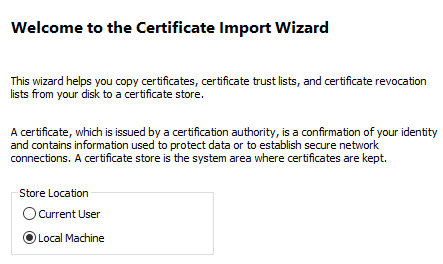
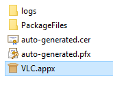
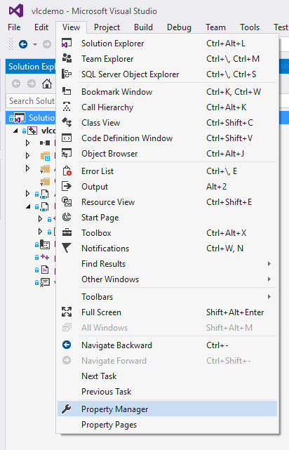
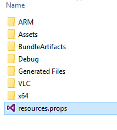
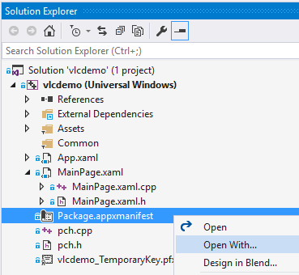
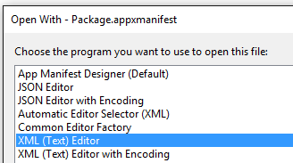

# VLC UWP Demo #


The VLC demo project wraps the Win32 [VLC media
player](http://www.videolan.org/vlc/index.html) with a UWP app. The UWP app
presents the user with several ads for other Windows Store apps, a Donate to VLC
button, and a means to dismiss the Ad view and go directly to the VLC player.
Selecting any option in the UWP front end will launch the VLC player and dismiss
the UWP app.

A Windows 10 UWP AppX of this demo is
[available](https://1drv.ms/u/s!ApzPPQxU0_aThvksl736QlJhqGV1iA). Note: This
version is x64 only.

On first launch of the VLC UWP app, the user is presented with the following UI:


VLC Demo UWP App

Selecting any option on the page will launch the Win32 VLC player and termimate
the VLC UWP app.


Win32 VLC Player

The VLC player (currently version 2.2.4) runs as a Win32 FullTrust application
and therefore all of its features should be available to the user. (This needs
to be fully tested)

The work to build this demo explored 2 areas:

1.  Building VLC as a Centennial App with the [Desktop App
    Converter](https://docs.microsoft.com/en-us/windows/uwp/porting/desktop-to-uwp-run-desktop-app-converter)

2.  Building VLC as a UWP app that contains all of the VLC files. Using the Desktop
    App Converter is not required.

The UWP VLC Demo app was built without using the Desktop App Converter. All of
the VLC app files are contained in the UWP app. The Win32 VLC player app is
launched from wihin the UWP app as a FullTrust process.

## How to convert VLC to a Centennial App using the Desktop App Converter ##

Although the UWP VLC demo did not use the Desktop App Converter to create the
demo app, the process for converting VLC to a Centennial App is documented
below. The AppxManifest.xml create by the Desktop App Converter is useful for
adding the file associations to the UWP version.

1.  Install the [Desktop App
    Converter](https://docs.microsoft.com/en-us/windows/uwp/porting/desktop-to-uwp-run-desktop-app-converter)

2.  Download the VLC player [installer](http://www.videolan.org/vlc/index.html)
    (currently v.2.2.4). There is no need to run the installer.

3.  Run the Desktop App Converter as administrator.

4.  Convert the VLC player to a Centennial App with the Desktop App Converter.
    The command below assumes you are in the directory where you downloaded the
    VLC installer.

```console
DesktopAppConverter.exe -Installer .\vlc-2.2.4-win32.exe -InstallerArguments "/L=1033 /S" -Destination .\output -PackageName "VLC" -Publisher "CN=vlc" -Version 2.2.4.0 -MakeAppx -Verbose -Sign
```

-   The InstallerArguments "/L=1033 /S" specify the english version of VLC
    (/L=1033) and a silent install (/S)

## Install Certificate ##

After the conversion is complete open the . folder. You will need to install the
certificate created by the Desktop App Converter. 1. Right click on the
auto-generated.cer file and select *Install Certificate*


Install Certificate

You will add the certificate to Local Machine Trusted Root Certification
Authorities



Select Local Machine

Select **Local Machine**. Click **Next**.


Select Certificate Store

Click the **Browse** button and select **Trusted Root Certification
Authorities**. Click **OK**. Click **Next**. Click **Finish**. The certificate
is now installed.

Note: You can also select the **Trusted Persons** store.

You can now install the AppX of the VLC app. Double click on the VLC.Appx file.



VLC AppX

Click on **Install**


Install VLC

You can now launch the Centennial version of VLC


Launch VLC

## Building the UWP VLC Demo App ##

The source code to the UWP VLC demo app is currently in a [private github
repo](https://github.com/stammen/vlcdemo). Please email <dalestam@microsoft.com>
with your github username to obtain access to the source code.

1. Clone the vlcdemo github repo.

    ```console
       git clone https://github.com/stammen/vlcdemo.git
    ```
    or with SSH

    ```console
        git clone git@github.com:stammen/vlcdemo.git
    ```

1. cd vlcdemo

1. Install the VLC player files into the project

    ```console
        .\get-vlc.bat
    ```

1. Open vlcdemo.sln. Select x86 or x64 for the platform. Select Debug or
    Release for the configuration. Build the solution.
    
1. In order to run the vlcdemo, select **Start without Debugging** from the **Debug** menu.

## Creating the AppX Package for the Windows Store ##
In order to create the AppX package for the Windows Store **do not use the Store option in Visual Studio**. You need to manually create the AppX using the MakeAppx.exe tool.

1. Select Deploy from the Build menu. You should have also selected a Release x64 build

1. After the Deploy build has completed, open a Command Prompt window and cd to vlcdemo\x64\Release\vlcdemo

1. Use the following command to build the AppX for the Windows Store:

    ```console
    "C:\Program Files (x86)\Windows Kits\10\bin\x86\MakeAppx.exe" pack /p .\VLC.appx /d .\AppX /l
    ```
    
1. You will need to sign the VLC.appx file with a certificate. Use the following commands to generate the certificate files. Do not add a password to the certificate.

    ```console
    "C:\Program Files (x86)\Windows Kits\10\bin\x86\MakeCert.exe" -r -h 0 -n "CN=vlc" -eku 1.3.6.1.5.5.7.3.3 -pe -sv vlc.pvk vlc.cer
    "C:\Program Files (x86)\Windows Kits\10\bin\x86\pvk2pfx.exe" -pvk vlc.pvk -spc vlc.cer -pfx vlc.pfx
    ```
    **Note: make sure the "CN=vlc" is the same CN used when the app was deployed. If they are different, you will get an error when trying to sign your appx.**

1. You can now sign the vlc.appx package with the  following command:
 
    ```console
    "C:\Program Files (x86)\Windows Kits\10\bin\x86\signtool.exe" sign -f vlc.pfx -fd SHA256 -v .\VLC.appx
    ```
1. You can now install the VLC.appx on your computer. Make sure any previous versions of VLC are uninstalled. For example, the Build and Deploy step installs the VLC appx, so you will need to unistall it before trying to install VLC.appx.

1. Install the vlc.cer certificate. Follow the same procedure as [Install Certificate](#install-certificate)

1. Double-click on the VLC.appx file. Click on the **Install** button.

1. The vlc demo is now installed on your computer.

## Coding Discussion ##

### Requirements ###

The following requirements are needed to build the vlcdemo:

1. [Visual Studio 2017](https://www.visualstudio.com/downloads/) with C++ UWP development package installed
1. [Desktop to UWP Packaging VSIX](http://go.microsoft.com/fwlink/?LinkId=797871)

### vlcdemo Projects ###

vlcdemo.sln contains the following three projects:

1. #### DesktopBridgeDebuggingProject ####

    This project was created using the [Desktop Bridge Debugging Project](http://go.microsoft.com/fwlink/?LinkId=797871) template installed into Visual Studio 2017. 
    This project enables a Classic Windows application to be debugged as a Universal Windows Platform application. This project is only used to assist in launching and debugging
    the other projects in the vlcdemo solution. It should be set as the Start project for the solution.
    
    
1. #### vlclauncher ####

    The vlclauncher project is a windowless Win32 application that is launched when the user attempts tp launch VLC. This app determines whether to launch the UWP ads app (vlcdemo) 
    on first launch or vlc.exe (VLC Media Player) on all other subsequent launches of VLC. After vlclauncher launches one of the other apps, it termimates. The vlclauncher also passes
    any command line arguments to vlc.exe.
    
1. #### vlcdemo ####

    The vlcdemo app is a Windows 10 UWP app with a XAML UI. It is only launched the first time a users launches VLC after an install of the VLC app from the Windows Store. It displays several
    ads for other Windows Store Apps and a Donate to VLC button. The user is also presented with a option to directly launch the VLC application.
    
1. #### vlc.exe ####

    The original Win32 vlc.exe application and all of its supporting files do not require a separate project. These files are contained in a separate VLC folder and are simply copies to the AppX package during a build.
    
### First Launch of the VLC Windows Store App ###

On first launch of the VLC Windows Store App, the following sequence occurs

1. vlclauncher is launched by Windows 10. This windowless Win32 app determines it is a first launch of the app. vlclauncher launches the vlcdemo UWP app to display the ads and donate button.
1. In the vlcdemo app:

    * user clicks on any desired options (ad or Donate)
    * User is presented with a Launch VLC option 
    * User clicks on Launch VLC
    * vlcdemo launches vlclauncher
    * vlcdemo terminates
    * vlclauncher determines this is no longer a first launch scenario and launches vlc.exe
    * vlclauncher terminates
    * vlc.exe runs as a FullTrust Win32 application with all of its features enabled
    
### Launch of the VLC Windows Store App After First Launch ###

1. vlclauncher is launched by Windows 10
1. vlclauncher determines it is not a first launch of the app
1. vlclauncher launches the vlc.exe and passes on any command line arguments
1. vlclauncher termimates
1. vlc.exe runs as a FullTrust Win32 application with all of its features enabled


### Adding the VLC App Files to the Project ###

The following code was added to support launching VLC from the UWP app.

A resources.props file was added to the project to copy the VLC files to the
AppX package. The resources.props file automates the adding of all of the VLC
files. The resource.props file was added to the vlcdemo project as follows.

Select **Property Manager** from the **View** menu



Property Manager

Right click on vlcdemo and select **Add Existing Property Sheet...**


Add Existing Property Sheet

Select the file **resources.props** from the vlcdemo folder.



Resources.props

Now whenever a build of the vlcdemo project occurs, the VLC app files will be
automatically copied to the AppX. This will also automate adding the VLC apps
files when a Store Package is built.

### Adding the Win32 VLC application to the App Manifest ###

The vlcdemo UWP app needs to be able to launch the Win32 vlc.exe app as a
FullTrust application. In order to do this, the Win32 vlc.exe app needs to be
added to the Package.appxmanifest file.

The xml of the Package.appxmanifest file must be edited with a text editor.

Right click on the Package.appxmanifest file file in the vlcdemo project. Select
**Open With...** from the pop-up menu.



Manifest Open With...

Select **XML (Text) Editor** from the list. Click **OK**.



Manifest Open With...

In the XML editor add the following XML schemas to the Package tag

```xml
    xmlns:rescap="http://schemas.microsoft.com/appx/manifest/foundation/windows10/restrictedcapabilities"
    xmlns:desktop="http://schemas.microsoft.com/appx/manifest/desktop/windows10"
    xmlns:uap2="http://schemas.microsoft.com/appx/manifest/uap/windows10/2" 
    xmlns:uap3="http://schemas.microsoft.com/appx/manifest/uap/windows10/3"
```

Add uap2, uap3, rescap and desktop to IgnorableNamespaces

```xml
    IgnorableNamespaces="uap uap2 uap3 mp rescap desktop"
```

We need to add the vlclauncher and vlcdemo apps in an Application tag in the Applications section. I added
the following:

```xml
    <Application Id="vlclauncher" Executable="vlclauncher.exe" EntryPoint="Windows.FullTrustApplication">
      <uap:VisualElements DisplayName="VLC" Square150x150Logo="Assets\AppMedTile.png" Square44x44Logo="Assets\AppList.png" Description="VLC Launcher" BackgroundColor="transparent">
        <uap:DefaultTile Wide310x150Logo="Assets\AppWideTile.png" Square310x310Logo="Assets\AppLargeTile.png">
          <uap:ShowNameOnTiles>
            <uap:ShowOn Tile="square150x150Logo" />
            <uap:ShowOn Tile="wide310x150Logo" />
            <uap:ShowOn Tile="square310x310Logo" />
          </uap:ShowNameOnTiles>
        </uap:DefaultTile>
        <uap:SplashScreen Image="Assets\AppSplashScreen.png" BackgroundColor="black" />
      </uap:VisualElements>
      <Extensions>
        <uap:Extension Category="windows.protocol" Executable="vlcdemo.exe" EntryPoint="vlcdemo.App">
          <uap:Protocol Name="vlc-ads" />
        </uap:Extension>
      </Extensions>
```

This Application tag specifies the vlclauncher as the default application for the VLC UWP app. vlclauncher will always run first when the user launches the VLC UWP app. 
Since vlclauncher is a FullTrustApplication, it can launch vlc.exe without any restrictions. vlclauncher can also launch the vlcdemo app using a Win10 uri protocol.

Note: The tiles specified in the Package.appxmanifest file were copied from the
Centennial version of VLC generated with the Desktop App Converter.

### Adding the VLC Media Player Files Associations ###

The VLC Media Player (vle.exe) supports many file associations that are enabled by its Win32 Installer. The DesktopAppConverter can capture these file associations and translate then into 
uap3:Extension tags that are added to the Package.appxmanifest file. The [How to convert VLC to a Centennial App using the Desktop App Converter](#how-to-convert-vlc-to-a-centennial-app-using-the-desktop-app-converter) 
describes this process in detail. After conversion, the Package.appxmanifest file in the PackageFiles directly contains all of the required uap3:Extension tags. For example:

```xml
<uap3:Extension Category="windows.fileTypeAssociation">
  <uap3:FileTypeAssociation Name="mp3" Parameters="--started-from-file &quot;%1&quot;">
    <uap:SupportedFileTypes>
      <uap:FileType>.mp3</uap:FileType>
    </uap:SupportedFileTypes>
    <uap2:SupportedVerbs>
      <uap3:Verb Id="AddToPlaylistVLC" Parameters="--started-from-file --playlist-enqueue &quot;%1&quot;">AddToPlaylistVLC</uap3:Verb>
      <uap3:Verb Id="PlayWithVLC" Parameters="--started-from-file --no-playlist-enqueue &quot;%1&quot;">PlayWithVLC</uap3:Verb>
    </uap2:SupportedVerbs>
  </uap3:FileTypeAssociation>
</uap3:Extension>
```

All of these extensions were copied into the Extensions section of the Package.appxmanifest file for the UWP VLC app.


